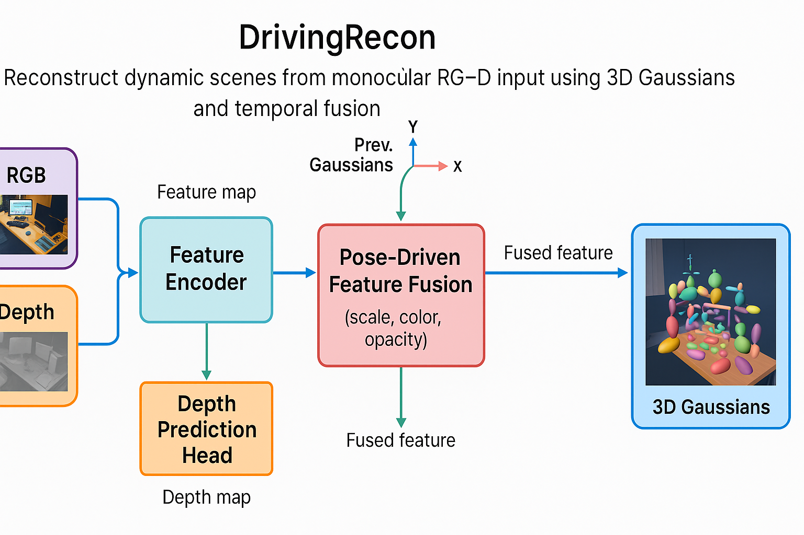

# DrivingRecon (Unofficial PyTorch Implementation)

This project is a step-by-step implementation of the paper:

> **DrivingRecon: Large 4D Gaussian Reconstruction Model for Autonomous Driving**  
> [arXiv:2412.09043](https://arxiv.org/abs/2412.09043)

It reconstructs dynamic scenes from monocular RGB-D input using 3D Gaussians and temporal fusion.

---

## 🚀 Features

- ✅ Feature Encoder (CNN)
- ✅ Depth Prediction Head
- ✅ 3D Position Encoding
- ✅ Pose-Driven (PD) Feature Fusion
- ✅ Gaussian Decoder (scale, color, opacity)
- ✅ Panda3D-based 3D Gaussian visualization
- ✅ Multiple-frame fusion (4D scene reconstruction)

---

## 📊 Architecture Diagram

Below is a simplified diagram of the DrivingRecon pipeline :  



---

## 📁 Folder Structure

```
DrivingRecon/
├── data/                           # RGB-D dataset (e.g. TUM freiburg1_desk)
│   ├── rgb/                        # RGB images
│   └── depth/                      # Depth maps
│   └── poses.txt                   # Ground-truth or estimated camera poses
├── models/
│   ├── encoder.py                  # CNN encoder
│   ├── depth_head.py               # Depth prediction
│   ├── pd_block.py                 # Pose-driven fusion
│   └── gaussian_decoder.py         # Predicts scale, color, opacity
├── utils/
│   ├── dataset.py                  # TUM RGB-D dataset loader
│   ├── projection.py               # 2D ↔ 3D coordinate projection
│   └── camera_utils.py             # Intrinsics, pose parsing
├── visualize_gaussians_panda.py    # 3D Gaussian visualization (Panda3D)
├── test_depth.py                   # Inference pipeline for a single or multiple frames
├── train.py                        # Training pipeline (optional)
├── requirements.txt
└── README.md
```

---

## 📦 Setup

### 1. Install dependencies

```bash
pip install -r requirements.txt
```

⚠️ Make sure you have `panda3d` and a working OpenGL display driver.

### 2. Prepare dataset

Use the TUM RGB-D dataset  
Recommended sequence for testing:
- `freiburg1_desk` (short, simple, looped motion)

Extract to:
```
DrivingRecon/data/
├── rgb/
├── depth/
└── poses.txt
```

---

## 🧪 Run Inference

```bash
python test_depth.py
```

Output:
- Feature shape, depth map stats
- 3D Gaussian tensor: shape `[1, H*W, 10]`
- Panda3D viewer shows colored ellipsoids

---

## 🏋️‍♂️ Train from Scratch (optional)

```bash
python train.py
```

Define training parameters and loss functions inside `train.py`.

---

## 💾 Save & Export

- Gaussian tensor exported as `.npz` or `.ply`
- Useful for downstream tasks like dynamic scene modeling, SLAM, or NeRF

---

## 📸 Sample Output

Add a screenshot to `docs/output_ellipsoids.png` to showcase output here.

---

## 📚 Citation

If you use this code, please cite the original paper:

```bibtex
@article{DrivingRecon2024,
  title={DrivingRecon: Large 4D Gaussian Reconstruction Model for Autonomous Driving},
  author={Li, Xiaohan and Wang, Dingfu and Shi, Jing},
  journal={arXiv preprint arXiv:2412.09043},
  year={2024}
}
```

---

## 🧠 License

This is an unofficial research implementation for educational purposes only.

---
